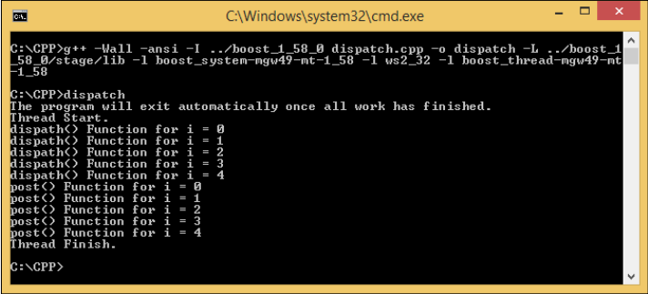

**Boost.Asio** là một tập hợp các thư viện được sử dụng để xử lý dữ liệu không đồng bộ vì bản thân **Asio** là viết tắt của **Asynchronous I/O (input and output)**. Không đồng bộ
có nghĩa là một tác vụ cụ thể trong một chương trình sẽ hoạt động mà không chặn các tác vụ khác và **Boost.Asio** sẽ thông báo cho chương trình khi nó đã thực hiện xong tác vụ đó.

---

# Examining the I/O service in the `Boost.Asio` library

- The object của namespace `Boost::Asio` là `io_service`. **I/O service** là một kênh được sử dụng để truy cập tài nguyên của hệ điều hành và thiết lập giao tiếp giữa chương trình của Ta và hệ điều hành thực hiện các **I/O requests**. Ngoài ra còn có một **I/O object** có vai trò gửi các **I/O requests**. Ví dụ, đối tượng `tcp::socket` sẽ cung cấp yêu cầu lập trình socket từ chương trình của Ta tới hệ điều hành.

## Using and blocking the `run()` function

- Một trong những hàm được sử dụng thường xuyên nhất trong đối tượng **I/O service** là hàm `run()`. Nó được sử dụng để chạy vòng lặp xử lý sự kiện của đối tượng `io_service`. Nó sẽ chặn chương trình cho đến khi hoàn thành tất cả `work` trong đối tượng io_service và không còn **handler** nào được gửi đi. Nếu ta *stop* đối tượng `io_service`, nó sẽ không chặn chương trình nữa.

- Trong lập trình, sự kiện là một hành động hoặc sự sự kiện được chương trình phát hiện, sự kiện này sẽ được chương **handler** bằng cách sử dụng đối tượng **event handler**. Đối tượng `io_service` có một hoặc nhiều instance, nơi các sự kiện được xử lý, gọi là **event processing loop**.

```cpp
#include <boost/asio.hpp>
#include <iostream>

int main(void)
{
    boost::asio::io_service io_svc;
    boost::asio::io_service::work worker(io_svc);
    io_svc.run();
    return 0;
}
```

- The `work` class chịu trách nhiệm cho đối tượng `io_service` biết khi nào `work` bắt đầu và khi nào nó kết thúc. Nó sẽ đảm bảo rằng hàm `run()` trong đối tượng `io_service` sẽ không thoát ra trong thời gian `work` đang được tiến hành. Ngoài ra, nó sẽ đảm bảo rằng hàm `run()` thoát ra khi không còn `work` chưa hoàn thành nào.

## Using the non-blocking `poll()` function

- Hàm `poll()` được sử dụng để chạy các **handlers** sẵn sàng cho đến khi không còn **handlers** sẵn sàng hoặc cho đến khi đối tượng `io_service` bị dừng. Tuy nhiên, trái ngược với hàm `run()`, hàm `poll()` sẽ không chặn chương trình.

## Removing the work object

Ta cũng có thể bỏ chặn chương trình bằng cách xóa đối tượng `work` khỏi đối tượng `io_service`, nhưng phải sử dụng một con trỏ đến đối tượng `work` để xóa đối tượng `work`. Ta sẽ sử dụng con trỏ `shared_ptr`, một **smart pointer** được cung cấp bởi các thư viện **Boost**.

```cpp
/* removework.cpp */
#include <boost/asio.hpp>
#include <boost/shared_ptr.hpp>
#include <iostream>
int main(void)
{
    boost::asio::io_service io_svc;
    boost::shared_ptr<boost::asio::io_service::work> worker(
        new boost::asio::io_service::work(io_svc));
    worker.reset();
    io_svc.run();
    std::cout << "We will not see this line in console window :(" << std::endl;
    return 0;
}

```

## Dealing with many threads

- Ta mới chỉ xử lý một luồng cho một đối tượng `io_service` cho đến nay. Nếu ta muốn xử lý nhiều luồng hơn trong một đối tượng `io_service`, đoạn code sau sẽ giải thích cách thực hiện việc này:

```cpp
/* multithreads.cpp */
#include <boost/asio.hpp>
#include <boost/shared_ptr.hpp>
#include <boost/thread.hpp>
#include <iostream>

boost::asio::io_service io_svc;

int a = 0;

void WorkerThread()
{
    std::cout << ++a << ".\n";
    io_svc.run();
    std::cout << "End.\n";
}

int main(void)
{
    boost::shared_ptr<boost::asio::io_service::work> worker(
        new boost::asio::io_service::work(io_svc));
    std::cout << "Press ENTER key to exit!" << std::endl;
    boost::thread_group threads;
    for (int i = 0; i < 5; i++)
        threads.create_thread(WorkerThread);
    std::cin.get();
    io_svc.stop();
    threads.join_all();
    return 0;
}
```

---

# Understanding the Boost.Bind library

- Thư viện `Boost.Bind` được sử dụng để dễ dàng gọi một con trỏ hàm.

## Wrapping a function invocation

```cpp
/* uncalledbind.cpp */
#include <boost/bind.hpp>
#include <iostream>
#include <string>

void func()
{
    std::cout << "Binding Function" << std::endl;
}

void cubevolume(float f) {
    std::cout << "Volume of the cube is " << f * f * f << std::endl;
}

void identity(std::string name, int age, float height)
{
    std::cout << "Name : " << name << std::endl;
    std::cout << "Age : " << age << " years old" << std::endl;
    std::cout << "Height : " << height << " inch" << std::endl;
}

class TheClass
{
public:
    void identity(std::string name, int age, float height)
    {
        std::cout << "Name : " << name << std::endl;
        std::cout << "Age : " << age << " years old" << std::endl;
        std::cout << "Height : " << height << " inch" << std::endl;
    }
};

int main(void)
{
    boost::bind(&func)();
    boost::bind(&cubevolume, 4.23f)();
    boost::bind(&identity, "John", 25, 68.89f)();
    TheClass cls;
    boost::bind(&TheClass::identity, &cls, "John", 25, 68.89f)();
    return 0;
}
```

## Working with the `Boost.Bind` library

- Cho đến nay, ta đã có thể sử dụng `boost::bind` cho các global và class functions. Tuy nhiên, khi ta sử dụng đối tượng `io_service` với `boost::bind`, ta sẽ gặp lỗi **non-copyable error** vì không thể sao chép đối tượng `io_service`.
- Bây giờ, ta hãy xem xét lại multithreads.cpp. ta sẽ sửa đổi mã để giải thích việc sử dụng `boost::bind` cho đối tượng `io_service` và ta sẽ vẫn cần sự trợ giúp của con trỏ `shared_ptr`. Hãy xem đoạn mã sau:

```cpp
/* ioservicebind.cpp */
#include <boost/asio.hpp>
#include <boost/shared_ptr.hpp>
#include <boost/thread.hpp>
#include <boost/bind.hpp>
#include <iostream>

void WorkerThread(boost::shared_ptr<boost::asio::io_service> iosvc, int &counter)
{
    std::cout << counter << "\t" << iosvc << " " << &counter << ".\n";
    iosvc->run();
    std::cout << "End.\n";
}

int main(void)
{
    boost::shared_ptr<boost::asio::io_service> io_svc(new boost::asio::io_service);
    boost::shared_ptr<boost::asio::io_service::work> worker(new boost::asio::io_service::work(*io_svc));
    std::cout << "Press ENTER key to exit!" << std::endl;
    boost::thread_group threads;
    for (int i = 1; i <= 5; i++)
    {
        std::cout << " -- " << &i << std::endl;
        threads.create_thread(boost::bind(&WorkerThread, io_svc, boost::ref(i)));
    }
    std::cin.get();
    io_svc->stop();
    threads.join_all();
    return 0;
}
```

## Synchronizing data access with the `Boost.Mutex` library

- ta có thể thấy trong ảnh chụp màn hình trước rằng có một vấn đề định dạng ở đây. Bởi vì đối tượng `std::cout` là một đối tượng toàn cục, việc ghi vào nó từ các luồng khác nhau cùng một lúc có thể gây ra các vấn đề về định dạng đầu ra. Để giải quyết vấn đề này, ta có thể sử dụng một đối tượng `mutex` có thể được tìm thấy trong đối tượng `boost::mutex` được cung cấp bởi thư viện `thread`. **Mutex** được sử dụng để đồng bộ hóa quyền truy cập vào bất kỳ dữ liệu chung hoặc dữ liệu được chia sẻ nào. Để hiểu thêm về **Mutex**, hãy xem đoạn code sau:

```cpp
/* mutexbind.cpp */
#include <boost/asio.hpp>
#include <boost/shared_ptr.hpp>
#include <boost/thread.hpp>
#include <boost/bind.hpp>
#include <iostream>

boost::mutex global_stream_lock;

void WorkerThread(boost::shared_ptr<boost::asio::io_service> iosvc, int counter)
{
    global_stream_lock.lock();
    std::cout << counter << ".\n";
    global_stream_lock.unlock();
    iosvc->run();
    global_stream_lock.lock();
    std::cout << "End.\n";
    global_stream_lock.unlock();
}

int main(void)
{
    boost::shared_ptr<boost::asio::io_service> io_svc(new boost::asio::io_service);
    boost::shared_ptr<boost::asio::io_service::work> worker(new boost::asio::io_service::work(*io_svc));
    std::cout << "Press ENTER key to exit!" << std::endl;
    boost::thread_group threads;
    for (int i = 1; i <= 5; i++)
        threads.create_thread(boost::bind(&WorkerThread, io_svc, i));
    std::cin.get();
    io_svc->stop();
    threads.join_all();
    return 0;
}
```

- ta khởi tạo đối tượng `mutex` mới: `global_stream_lock`. Với đối tượng này, ta có thể gọi các hàm `lock()` và `unlock()`. Hàm `lock()` sẽ chặn các luồng khác truy cập cùng một chức năng để chờ luồng hiện tại kết thúc. Các luồng khác có thể truy cập cùng một chức năng nếu chỉ luồng hiện tại gọi hàm `unlock()`. Một điều cần nhớ là ta không nên gọi hàm `lock()` một cách đệ quy vì nếu hàm `lock()` không được mở khóa bởi hàm `unlock()` thì sẽ xảy ra hiện tượng `thread deadlock` và nó sẽ đóng băng ứng dụng. Vì vậy, ta phải cẩn thận khi sử dụng các hàm `lock()` và `unlock()`.

---

# Giving some work to the **I/O** service

- Bây giờ, đã đến lúc ta đưa một số `work` cho đối tượng `io_service`. Biết thêm về `boost::bind` và `boost::mutex` sẽ giúp ta cung cấp cho đối tượng `io_service` `work` phải làm. Có hai hàm thành viên trong đối tượng `io_service`: hàm `post()` và `dict()`, ta sẽ thường xuyên sử dụng để thực hiện việc này. Hàm `post()` được sử dụng để yêu cầu đối tượng `io_service` chạy `work` của đối tượng `io_service` sau khi ta xếp hàng tất cả `work`, vì vậy nó không cho phép ta chạy `work` ngay lập tức. Trong khi `dispatch()` cũng được sử dụng để yêu cầu đối tượng `io_service` chạy `work` của đối tượng `io_service`, nhưng nó sẽ thực thi `work` ngay lập tức mà không cần xếp hàng đợi.

## Using the `post()` function

- Hãy kiểm tra hàm `post()` bằng cách tạo đoạn mã sau. ta sẽ sử dụng tệp `mutexbind.cpp` làm mã cơ sở của mình, vì ta sẽ chỉ sửa đổi mã nguồn:

```cpp
/* post.cpp */
#include <boost/asio.hpp>
#include <boost/shared_ptr.hpp>
#include <boost/thread.hpp>
#include <boost/bind.hpp>
#include <iostream>

boost::mutex global_stream_lock;

void WorkerThread(boost::shared_ptr<boost::asio::io_service> iosvc, int counter)
{
    global_stream_lock.lock();
    std::cout << counter << ".\n";
    global_stream_lock.unlock();
    iosvc->run();
    global_stream_lock.lock();
    std::cout << "End.\n";
    global_stream_lock.unlock();
}

size_t fac(size_t n)
{
    if (n <= 1)
    {
        return n;
    }
    boost::this_thread::sleep(boost::posix_time::milliseconds(1000));
    return n * fac(n - 1);
}

void CalculateFactorial(size_t n)
{
    global_stream_lock.lock();
    std::cout << "Calculating " << n << "! factorial" << std::endl;
    global_stream_lock.unlock();
    size_t f = fac(n);
    global_stream_lock.lock();
    std::cout << n << "! = " << f << std::endl;
    global_stream_lock.unlock();
}

int main(void)
{
    boost::shared_ptr<boost::asio::io_service> io_svc(new boost::asio::io_service);
    boost::shared_ptr<boost::asio::io_service::work> worker(new boost::asio::io_service::work(*io_svc));

    global_stream_lock.lock();
    std::cout << "The program will exit once all work has finished." << std::endl;
    global_stream_lock.unlock();

    boost::thread_group threads;
    for (int i = 1; i <= 5; i++)
        threads.create_thread(boost::bind(&WorkerThread, io_svc, i));

    io_svc->post(boost::bind(CalculateFactorial, 5));
    io_svc->post(boost::bind(CalculateFactorial, 6));
    io_svc->post(boost::bind(CalculateFactorial, 7));
    worker.reset();
    threads.join_all();
    return 0;
}
```

## Using the `dispatch()` function

- Bây giờ, hãy kiểm tra hàm `dispatch()` để cung cấp cho hàm `io_service` một số `work`. ta sẽ vẫn sử dụng tệp `mutexbind.cpp` làm mã cơ sở của mình và ta sẽ sửa đổi nó một chút để nó trở thành như thế này:

```cpp
/* dispatch.cpp */
#include <boost/asio.hpp>
#include <boost/shared_ptr.hpp>
#include <boost/thread.hpp>
#include <boost/bind.hpp>
#include <iostream>

boost::mutex global_stream_lock;

void WorkerThread(boost::shared_ptr<boost::asio::io_service> iosvc)
{
    global_stream_lock.lock();
    std::cout << "Thread Start.\n";
    global_stream_lock.unlock();
    iosvc->run();
    global_stream_lock.lock();
    std::cout << "Thread Finish.\n";
    global_stream_lock.unlock();
}

void Dispatch(int i)
{
    global_stream_lock.lock();
    std::cout << "dispath() Function for i = " << i << std::endl;
    global_stream_lock.unlock();
}

void Post(int i)
{
    global_stream_lock.lock();
    std::cout << "post() Function for i = " << i << std::endl;
    global_stream_lock.unlock();
}

void Running(boost::shared_ptr<boost::asio::io_service> iosvc)
{
    for (int x = 0; x < 5; ++x)
    {
        iosvc->dispatch(boost::bind(&Dispatch, x));
        iosvc->post(boost::bind(&Post, x));
        boost::this_thread::sleep(boost::posix_time::milliseconds(1000));
    }
}

int main(void)
{
    boost::shared_ptr<boost::asio::io_service> io_svc(new boost::asio::io_service);
    boost::shared_ptr<boost::asio::io_service::work> worker(new boost::asio::io_service::work(*io_svc));

    global_stream_lock.lock();
    std::cout << "The program will exit automatically once all work has finished." << std::endl;
    global_stream_lock.unlock();

    boost::thread_group threads;
    threads.create_thread(boost::bind(&WorkerThread, io_svc));

    io_svc->post(boost::bind(&Running, io_svc));
    worker.reset();
    threads.join_all();
    return 0;
}
```

[]()

- Khác với tệp `post.cpp`, trong tệp `dispatch.cpp`, ta chỉ tạo một chuỗi `WorkerThread`. Ngoài ra, ta thêm hai hàm, `dispatch()` và `post()` để hiểu sự khác biệt giữa cả hai hàm:

```cpp
iosvc->dispatch(boost::bind(&Dispatch, x));
iosvc->post(boost::bind(&Post, x));
```

- Nếu ta nhìn vào đoạn code trên, bên trong hàm `Running()`, ta mong đợi nhận được kết quả đầu ra có thứ tự giữa các hàm `dispatch()` và `post()`. Tuy nhiên, khi ta xem kết quả, ta thấy rằng kết quả là khác nhau vì hàm `dispatch()` được gọi trước và hàm `post()` được gọi sau nó. Điều này xảy ra bởi vì hàm `dispatch()` có thể được gọi từ luồng worker hiện tại, trong khi hàm `post()` phải đợi cho đến khi **handler** của worker hoàn tất trước khi nó có thể được gọi. Nói cách khác, các sự kiện của hàm `send()` có thể được thực thi từ luồng worker hiện tại ngay cả khi có các sự kiện đang chờ xử lý khác được xếp hàng đợi, trong khi các sự kiện của hàm `post()` phải đợi cho đến khi **handler** hoàn thành việc thực thi trước khi được phép thực thi.

---

# Summary
- There are two functions that we can use to get the `io_service` object working for us: the `run()` and `poll()` member functions. The `run()` function blocks the program because it has to wait for the work that we assign to it, while the `poll()` function does not block the program. When we need to give some work to the `io_service`object, we simply use the `poll()` or `run()` functions, depending on what we need, and then we call the `post()`or `dispatch()` functions as needed. The `post()` function is used to command the `io_service` object in order to run the given handler, but without permitting the handler is called by the `io_service` object from inside this function. While the `dispatch()` function is used to call the handler in the thread in which the `run()`or `poll()` functions are currently being invoked. The fundamental difference between the `dispatch()` and the `post()` functions is that the `dispatch()` function completes the work right away whenever it can, while the `post()` function always queues the work.
- We found out about the `io_service` object, how to run it, and how to give it some work. Now, let's move to the next chapter to find out more about the **Boost.Asio** library, and we will be one step closer to creating our network programming.
