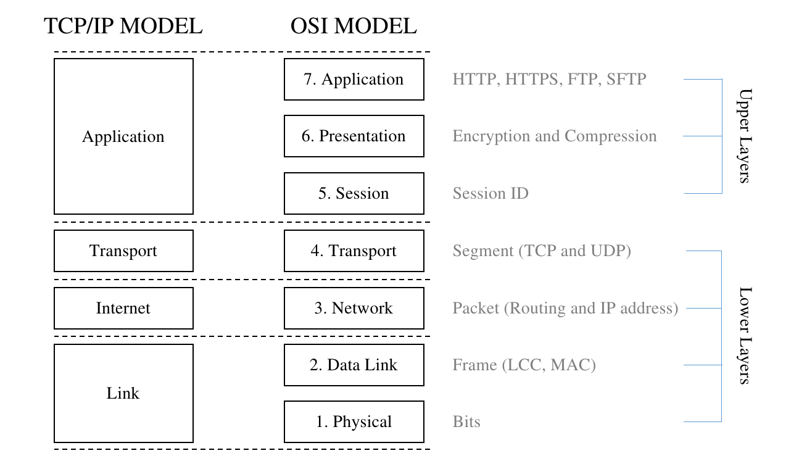

# Networking System
- Network architecture được cấu trúc thành các layers và protocols.
- Từng layer trong cấu trúc mạng có vai trò riêng và mục đính chính là cung cấp 1 service nào đó tới layer cao hơn và giao tiếp với layer liền kề.
- Protocols là một tập các rule và conventions được sử dụng cho giao tiếp giữa các phần tử --> để tiêu chuẩn hóa quá trình giao tiếp.
- Hai kiến trúc mạng phổ biến hiện nay: **OSI (Open System Interconnection)**, **TCP/IP**.

---
# The OSI reference model

- **OSI model** được sử dụng để kết nối các open system mà không phụ thuộc vào hệ điều hành.
- **OSI model** gồm 7 layer, mỗi layer có chức năng xác địn và định nghĩa các dữ liệu được xử lý.

## The Physical Layer

- Đây là lớp đầu tiên trong **OSI model** và định nghĩa các thông số kỹ thuật vật lý của mạng, bao gồm physical media (cables, connectors) và basic devices (repeaters, hubs).
- Layer này có trách nhiệm luồng dữ liệu truyền các bit thô đầu vào thành các số **0** và các số **1** trên kênh truyền thông. Nó quan tâm tới việc bảo toàn dữ liệu và đảm bảo rằng các bits được gửi từ 1 thiết bị đến thiết bị khác là hoàn toàn giống nhau.

## The Data Link layer

- Nhiệm vụ của lớp **Data Link** cung cấp liên kết cho việc truyền raw data. Trước khi data được truyền đi, nó được chia thành các **data frames**, và **Data Link** truyền chúng liên tiếp. Bên nhận sẽ gửi lại một **acknowledge frame** với từng frame được gửi đối với service tin cậy.
- **Data Link layer** gồm 2 sublayers: **Logical Link Control (LLC)** và **Media Access Control (MAC)**. **LLC sublayer** có nhiệm vụ check lỗi truyền thông tin và quản lý việc truyền dữ liệu, trong khi **MAC sublayer** xác định các để lấy dữ liệu từ **physical media** hoặc lưu data vào **physical media**.
- **MAC adress** hay còn gọi là **physical address** được sử dụng để định danh từng thiết bị kết nối vào mạng và nó là unique.

## The Network layer

- **Network layer** có nhiệm vụ xác định các tốt nhất để định tuyến các packets từ thiết bị nguồn đến thiết bị đích. Nó sẽ tạo ra các **routing tables** sử dụng **Internet Protocol (IP)** là **routing protocol**, và địa chỉ IP được sử dụng để đảm bảo rằng dữ liệu được định tuyến đến đích cần thiết. Hiện nay có hai phiên bản IP: IPv4 và IPv6.

## The Transport layer

- **Transport layer** có nhiệm vụ truyền dữ liệu từ nguồn tới đích. Nó sẽ chia dữ liệu thành các phần nhỏ hơn gọi là **segments**. và sau đó ghép nối tất cả các **segments** để khôi phục lại dữ liệu ban đầu tại đích.
- Có 2 giao thức chính làm việc ở layer này: **Transmission Control Protocol (TCP)** và **User Datagram Protocol(UDP)**.
-**TCP** cung cấp trao đổi data bằng việc thiết lập một **session**. Dữ liệu sẽ không được truyền đi cho đến khi **session** được thiết lập. **TCP** được gọi là **connection-oriented protocol** - nghĩa là session phải được thiết lập trước khi truyền dữ liệu.
- **UDP** là phương pháp truyền dữ liệu không đảm bảo vì nó không thiết lập một session nào. **UDP** được gọi là **connection-less protocol**.
## The Session layer

- **Session layer** có nhiệm vụ thiết lập, duy trì, kết thúc session. Có thể tưởng tượng một **session** như một kết nối giữa 2 thiết bị trong mạng.
- Ví dụ, nếu chúng ta muốn gửi một tệp từ một máy tính sang một máy tính khác, **layer** này sẽ thiết lập kết nối trước khi tệp có thể được gửi đi. **Layer** này sau đó sẽ đảm bảo rằng kết nối vẫn hoạt động cho đến khi tệp được gửi hoàn toàn. Cuối cùng, **layer** sẽ chấm dứt kết nối nếu nó không còn cần thiết nữa. Kết nối mà chúng ta nói đến là **session**.
- **Session layer** cũng đảm bảo rằng dữ liệu từ một ứng dụng khác không bị thay thế cho nhau. Ví dụ: nếu chúng tôi chạy trình duyệt Internet, ứng dụng trò chuyện và trình quản lý tải xuống cùng một lúc, **session layer** sẽ chịu trách nhiệm thiết lập các **session** cho mọi ứng dụng và đảm bảo rằng chúng vẫn tách biệt với các ứng dụng khác.
- Có ba phương pháp giao tiếp được sử dụng bởi lớp này: **simplex**, **half-duplex** hoặc **full-duplex**. Trong **simplex**, dữ liệu chỉ có thể được chuyển bởi một bên, vì vậy bên kia không thể chuyển bất kỳ dữ liệu nào. Phương pháp này không còn được sử dụng phổ biến nữa, vì chúng ta cần các ứng dụng có thể tương tác với nhau. Trong **half-duplex**, bất kỳ dữ liệu nào cũng có thể được chuyển đến tất cả các thiết bị liên quan, nhưng chỉ một thiết bị có thể chuyển dữ liệu một lúc. **Full-duplex** có thể truyền dữ liệu đến tất cả các thiết bị cùng một lúc. Để gửi và nhận dữ liệu, phương pháp này sử dụng các đường dẫn khác nhau.

<<<<<<< HEAD
## The Presentation layer

- Vai trò của **Presentation layer** được sử dụng để xác định dữ liệu đã được gửi, dịch dữ liệu sang định dạng thích hợp, sau đó biểu diễn dữ liệu.-
- Ví dụ, chúng tôi gửi tệp MP3 qua mạng và tệp được chia thành nhiều **segments**. Sau đó, sử dụng thông tin **header** trên segment, lớp này sẽ tạo tệp bằng cách dịch các phân đoạn.
Hơn nữa, lớp này chịu trách nhiệm nén và giải nén dữ liệu vì tất cả dữ liệu truyền qua Internet được nén để tiết kiệm băng thông.
- Lớp này cũng chịu trách nhiệm mã hóa và giải mã dữ liệu để bảo mật giao tiếp giữa hai thiết bị.

## The Application layer

- **Application layer** xử lý ứng dụng máy tính được người dùng sử dụng. Chỉ ứng dụng kết nối với mạng mới kết nối với lớp này. Lớp này gồm nhiều giao thức mà người dùng cần, như sau:
- [**Hệ thống tên miền (DNS)**](The_Domain_Name_System): Giao thức này là giao thức tìm thấy tên máy chủ của một địa chỉ IP. Với hệ thống này, chúng ta không cần phải ghi nhớmọi địa chỉ IP nữa, chỉ là tên máy chủ. Chúng ta có thể dễ dàng nhớ một từ trong tên máy chủ thay vì một loạt các số trong địa chỉ IP.
- [**Giao thức truyền siêu văn bản (HTTP)**](The_Hypertext_Transfer_Protocol): Giao thức này là giao thức truyền dữ liệu qua Internet trên các trang web. Chúng tôi cũng có định dạng HTTPS được sử dụng để gửi dữ liệu được mã hóa cho các vấn đề bảo mật.
- [**Giao thức truyền tệp (FTP)**](The_File_Transfer_Protocol): Giao thức này là giao thức được sử dụng để chuyển tệp từ hoặc đến máy chủ FTP.
- [**The Trivial FTP (TFTP)**](The_Trivial_FTP): Giao thức này tương tự như FTP, được sử dụng để gửi các tệp nhỏ hơn.
- [**Giao thức cấu hình máy chủ động (DHCP)**](The_Dynamic_Host_Configuration_Protocol): Giao thức này là một phương thức được sử dụng để chỉ định cấu hình TCP / IP động.
- [**Giao thức Bưu điện (POP3)**](The_Simple_Mail_Transfer_Protocol): Giao thức này là một giao thức thư điện tử được sử dụng để lấy lại e-mail từ máy chủ POP3. Máy chủ thường được lưu trữ bởi [**nhà cung cấp dịch vụ Internet (ISP)**](Internet_Service_Provider).
- [**Giao thức Truyền Thư Đơn giản (SMTP)**](The_Simple_Mail_Transfer_Protocol): Giao thức này trái ngược với POP3 và được sử dụng để gửi thư điện tử.
- [**Giao thức truy cập tin nhắn Internet (IMAP)**](The_Internet_Message_Access_Protocol): Giao thức này được sử dụng để nhận tin nhắn e-mail. Với giao thức này, người dùng có thể lưu e-mail của họ thư trên thư mục của họ trên máy tính cục bộ.
- [**Giao thức quản lý mạng đơn giản (SNMP)**](The_Simple_Network_Management_Protocol): Giao thức này được sử dụng để quản lý các thiết bị mạng (bộ định tuyến và bộ chuyển mạch) và phát hiện các vấn đề báo cáo chúng trước khi chúng trở nên quan trọng.
- [**Khối thông báo máy chủ (SMB)**](The_Server_Message_Block): Giao thức này là một FTP được sử dụng trên Mạng của Microsoft chủ yếu để chia sẻ tệp và máy in.

- **Application layer** cũng quyết định xem tài nguyên mạng có đủ cho truy cập. Ví dụ, nếu bạn muốn lượt Internet bằng trình duyệt, Application layer quyết định Internet có khả dụng cho HTTP không.

---

## The Presentation layer
main
