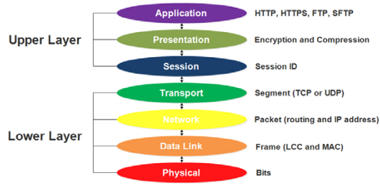
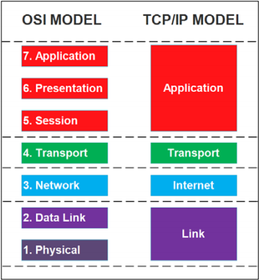
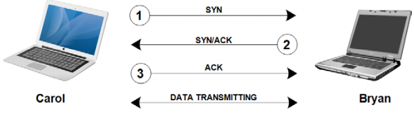

# Networking System
- Network architecture được cấu trúc thành các layers và protocols.
- Từng layer trong cấu trúc mạng có vai trò riêng và mục đính chính là cung cấp 1 service nào đó tới layer cao hơn và giao tiếp với layer liền kề.
- Protocols là một tập các rule và conventions được sử dụng cho giao tiếp giữa các phần tử --> để tiêu chuẩn hóa quá trình giao tiếp.
- Hai kiến trúc mạng phổ biến hiện nay: **OSI (Open System Interconnection)**, **TCP/IP**.

---

# The OSI reference model

- **OSI model** được sử dụng để kết nối các open system mà không phụ thuộc vào hệ điều hành.
- **OSI model** gồm 7 layer, mỗi layer có chức năng xác địn và định nghĩa các dữ liệu được xử lý.

## The Physical Layer

- Đây là lớp đầu tiên trong **OSI model** và định nghĩa các thông số kỹ thuật vật lý của mạng, bao gồm physical media (cables, connectors) và basic devices (repeaters, hubs).
- Layer này có trách nhiệm luồng dữ liệu truyền các bit thô đầu vào thành các số **0** và các số **1** trên kênh truyền thông. Nó quan tâm tới việc bảo toàn dữ liệu và đảm bảo rằng các bits được gửi từ 1 thiết bị đến thiết bị khác là hoàn toàn giống nhau.

## The Data Link layer

- Nhiệm vụ của lớp **Data Link** cung cấp liên kết cho việc truyền raw data. Trước khi data được truyền đi, nó được chia thành các **data frames**, và **Data Link** truyền chúng liên tiếp. Bên nhận sẽ gửi lại một **acknowledge frame** với từng frame được gửi đối với service tin cậy.
- **Data Link layer** gồm 2 sublayers: **Logical Link Control (LLC)** và **Media Access Control (MAC)**. **LLC sublayer** có nhiệm vụ check lỗi truyền thông tin và quản lý việc truyền dữ liệu, trong khi **MAC sublayer** xác định các để lấy dữ liệu từ **physical media** hoặc lưu data vào **physical media**.
- **MAC adress** hay còn gọi là **physical address** được sử dụng để định danh từng thiết bị kết nối vào mạng và nó là unique.

## The Network layer

- **Network layer** có nhiệm vụ xác định các tốt nhất để định tuyến các packets từ thiết bị nguồn đến thiết bị đích. Nó sẽ tạo ra các **routing tables** sử dụng **Internet Protocol (IP)** là **routing protocol**, và địa chỉ IP được sử dụng để đảm bảo rằng dữ liệu được định tuyến đến đích cần thiết. Hiện nay có hai phiên bản IP: IPv4 và IPv6.

## The Transport layer

- **Transport layer** có nhiệm vụ truyền dữ liệu từ nguồn tới đích. Nó sẽ chia dữ liệu thành các phần nhỏ hơn gọi là **segments**. và sau đó ghép nối tất cả các **segments** để khôi phục lại dữ liệu ban đầu tại đích.
- Có 2 giao thức chính làm việc ở layer này: **Transmission Control Protocol (TCP)** và **User Datagram Protocol(UDP)**.
-**TCP** cung cấp trao đổi data bằng việc thiết lập một **session**. Dữ liệu sẽ không được truyền đi cho đến khi **session** được thiết lập. **TCP** được gọi là **connection-oriented protocol** - nghĩa là session phải được thiết lập trước khi truyền dữ liệu.
- **UDP** là phương pháp truyền dữ liệu không đảm bảo vì nó không thiết lập một session nào. **UDP** được gọi là **connection-less protocol**.
## The Session layer

- **Session layer** có nhiệm vụ thiết lập, duy trì, kết thúc session. Có thể tưởng tượng một **session** như một kết nối giữa 2 thiết bị trong mạng.
- Ví dụ, nếu chúng ta muốn gửi một tệp từ một máy tính sang một máy tính khác, **layer** này sẽ thiết lập kết nối trước khi tệp có thể được gửi đi. **Layer** này sau đó sẽ đảm bảo rằng kết nối vẫn hoạt động cho đến khi tệp được gửi hoàn toàn. Cuối cùng, **layer** sẽ chấm dứt kết nối nếu nó không còn cần thiết nữa. Kết nối mà chúng ta nói đến là **session**.
- **Session layer** cũng đảm bảo rằng dữ liệu từ một ứng dụng khác không bị thay thế cho nhau. Ví dụ: nếu bạn chạy trình duyệt Internet, ứng dụng trò chuyện và trình quản lý tải xuống cùng một lúc, **session layer** sẽ chịu trách nhiệm thiết lập các **session** cho mọi ứng dụng và đảm bảo rằng chúng vẫn tách biệt với các ứng dụng khác.
- Có ba phương pháp giao tiếp được sử dụng bởi lớp này: **simplex**, **half-duplex** hoặc **full-duplex**. Trong **simplex**, dữ liệu chỉ có thể được chuyển bởi một bên, vì vậy bên kia không thể chuyển bất kỳ dữ liệu nào. Phương pháp này không còn được sử dụng phổ biến nữa, vì chúng ta cần các ứng dụng có thể tương tác với nhau. Trong **half-duplex**, bất kỳ dữ liệu nào cũng có thể được chuyển đến tất cả các thiết bị liên quan, nhưng chỉ một thiết bị có thể chuyển dữ liệu một lúc. **Full-duplex** có thể truyền dữ liệu đến tất cả các thiết bị cùng một lúc. Để gửi và nhận dữ liệu, phương pháp này sử dụng các đường dẫn khác nhau.

## The Presentation layer

- Vai trò của **Presentation layer** được sử dụng để xác định dữ liệu đã được gửi, dịch dữ liệu sang định dạng thích hợp, sau đó biểu diễn dữ liệu.
- Ví dụ, bạn gửi tệp MP3 qua mạng và tệp được chia thành nhiều **segments**. Sau đó, sử dụng thông tin **header** trên segment, lớp này sẽ tạo tệp bằng cách dịch các *segment*.
Hơn nữa, lớp này chịu trách nhiệm nén và giải nén dữ liệu vì tất cả dữ liệu truyền qua Internet được nén để tiết kiệm băng thông.
- Lớp này cũng chịu trách nhiệm mã hóa và giải mã dữ liệu để bảo mật giao tiếp giữa hai thiết bị.

## The Application layer

- **Application layer** xử lý ứng dụng máy tính được người dùng sử dụng. Chỉ ứng dụng kết nối với mạng mới kết nối với lớp này. Lớp này gồm nhiều giao thức mà người dùng cần, như sau:
- [**Hệ thống tên miền (DNS)**](The_Domain_Name_System): Giao thức này là giao thức tìm thấy tên máy chủ của một địa chỉ IP. Với hệ thống này, chúng ta không cần phải ghi nhớmọi địa chỉ IP nữa, chỉ là tên máy chủ. Chúng ta có thể dễ dàng nhớ một từ trong tên máy chủ thay vì một loạt các số trong địa chỉ IP.
- [**Giao thức truyền siêu văn bản (HTTP)**](The_Hypertext_Transfer_Protocol): Giao thức này là giao thức truyền dữ liệu qua Internet trên các trang web. bạn cũng có định dạng HTTPS được sử dụng để gửi dữ liệu được mã hóa cho các vấn đề bảo mật.
- [**Giao thức truyền tệp (FTP)**](The_File_Transfer_Protocol): Giao thức này là giao thức được sử dụng để chuyển tệp từ hoặc đến máy chủ FTP.
- [**The Trivial FTP (TFTP)**](The_Trivial_FTP): Giao thức này tương tự như FTP, được sử dụng để gửi các tệp nhỏ hơn.
- [**Giao thức cấu hình máy chủ động (DHCP)**](The_Dynamic_Host_Configuration_Protocol): Giao thức này là một phương thức được sử dụng để chỉ định cấu hình TCP / IP động.
- [**Giao thức Bưu điện (POP3)**](The_Simple_Mail_Transfer_Protocol): Giao thức này là một giao thức thư điện tử được sử dụng để lấy lại e-mail từ máy chủ POP3. Máy chủ thường được lưu trữ bởi [**nhà cung cấp dịch vụ Internet (ISP)**](Internet_Service_Provider).
- [**Giao thức Truyền Thư Đơn giản (SMTP)**](The_Simple_Mail_Transfer_Protocol): Giao thức này trái ngược với POP3 và được sử dụng để gửi thư điện tử.
- [**Giao thức truy cập tin nhắn Internet (IMAP)**](The_Internet_Message_Access_Protocol): Giao thức này được sử dụng để nhận tin nhắn e-mail. Với giao thức này, người dùng có thể lưu e-mail của họ thư trên thư mục của họ trên máy tính cục bộ.
- [**Giao thức quản lý mạng đơn giản (SNMP)**](The_Simple_Network_Management_Protocol): Giao thức này được sử dụng để quản lý các thiết bị mạng (bộ định tuyến và bộ chuyển mạch) và phát hiện các vấn đề báo cáo chúng trước khi chúng trở nên quan trọng.
- [**Khối thông báo máy chủ (SMB)**](The_Server_Message_Block): Giao thức này là một FTP được sử dụng trên Mạng của Microsoft chủ yếu để chia sẻ tệp và máy in.

- **Application layer** cũng quyết định xem tài nguyên mạng có đủ cho truy cập. Ví dụ, nếu bạn muốn lượt Internet bằng trình duyệt, Application layer quyết định Internet có khả dụng cho HTTP không.

- Ta có thể chia tất cả bảy lớp thành hai lớp phần: **Upper layer** và **Lower layer**. **Upper layer** chịu trách nhiệm tương tác với người dùng và ít quan tâm đến các chi tiết cấp thấp, trong khi **Lower layer** chịu trách nhiệm truyền dữ liệu qua mạng, chẳng hạn như định dạng và mã hóa. Định dạng của dữ liệu di chuyển là khác nhau cho mỗi lớp. Có các bit cho **Physical layer**, frame cho **Data Link layer** v.v.

---

# The TCP/IP reference model

- **Mô hình TCP/IP** được tạo ra trước **mô hình OSI**. Mô hình này hoạt động theo cách tương tự như **mô hình OSI**, ngoại trừ việc nó chỉ chứa bốn lớp. Mỗi lớp trên **mô hình TCP/IP** tương ứng với các lớp của **mô hình OSI**. **Application Layer TCP/IP** ánh xạ **lớp 5, 6 và 7** của **mô hình OSI**. **Transport Layer TCP/IP** ánh xạ **lớp 4** của **mô hình OSI**. Lớp **Internet Layer TCP/IP** ánh xạ **lớp 3** của mô hình OSI. **Link Layer TCP/IP** ánh xạ **lớp 1 và 2** của **mô hình OSI**. Hãy xem hình sau để biết thêm chi tiết:

- **Link Layer** chịu trách nhiệm xác định các giao thức và thiết bị vật lý được sử dụng trong quá trình truyền dữ liệu.
- **Internet Layer** có nhiệm vụ xác định định tuyến tốt nhất cho quá trình truyền dữ liệu theo địa chỉ gói tin.
- **Transport Layer** có nhiệm vụ thiết lập giao tiếp giữa hai thiết bị và gửi gói tin.
- **Application Layer** có nhiệm vụ cung cấp dịch vụ cho các ứng dụng chạy trên máy tính. Do không có **Session Layer** và **Presentation Layer**, nên **Application Layer** phải có chức năng của **session layer** và **presentation layer**.

- Dưới đây là các giao thức và các thiết bị liên quan tới **TCP/IP model**:

|Layer|Protocol|Device|
|:---:|---|---|
|Application|HTTP, HTTPS, SMTP, POP3, and DNS|Proxy Server and Firewall|
|Transport|TCP and UDP|-|
|Internet|IP and ICMP|Router|
|Link|Ethernet, Token Ring, and Frame Relay|Hub, Modem, and Repeater|

---

# Understanding TCP and UDP

- Trong **Transport layer**, **TCP** và **UDP** là các giao thức chính được sử dụng để truyền dữ liệu qua mạng. Cơ chế truyền nhận của chúng khác nhau. **TCP** có **acknowledgements**, **sequence numbers**, và **flow control** trong truyền dữ liệu, để cung cấp một việc truyền nhận được đảm bảo. Trong khi **UDP** không có sự đảm bảo, mà nó cung cấp việc truyền dữ liệu hiệu quả nhất.

## Transmission Control Protocol

- **TCP** thực hiện 1 quá trình **handshaking 3 bước** trước khi giao thức thiết lập 1 session. Nó giúp tạo ra một kết nối đảm bảo.

- Từ ảnh trên, hãy tưởng tượng rằng thiết bị của Carol muốn truyền dữ liệu đến thiết bị của Bryan và chúng cần thực hiện quá trình **handshaking 3 bước**. Đầu tiên, thiết bị của Carol gửi một gói đến thiết bị của Bryan với cờ đồng bộ hóa **(SYN)** được bật. Sau khi thiết bị của Bryan nhận được gói, nó sẽ trả lời bằng cách gửi một gói khác đã bật cả cờ **(SYN)** và xác nhận **(ACK)**. Cuối cùng, thiết bị của Carol hoàn thành quá trình bắt tay bằng cách gửi một gói thứ ba với cờ **(ACK)** được bật. Giờ đây, cả hai thiết bị đều có phiên được thiết lập và đảm bảo rằng thiết bị kia đang hoạt động. Sau đó, quá trình truyền dữ liệu đã sẵn sàng để thực hiện sau khi phiên được thiết lập.
- **TCP** cũng chia dữ liệu thành các *segment* nhỏ hơn và sử dụng số thứ tự để theo dõi các *segment* này. Mỗi *segment* được phân tách được gán các số thứ tự khác nhau, chẳng hạn như 1 đến 20. Sau đó, thiết bị đích sẽ nhận từng *segment* và sử dụng các số thứ tự để tập hợp lại tệp dựa trên thứ tự của chuỗi. Ví dụ: hãy xem xét rằng Carol muốn tải xuống tệp hình ảnh JPEG từ thiết bị của Bryan. Sau khi thiết lập phiên theo quy trình **handshaking 3 bước**, hai thiết bị xác định độ lớn của *segment* đơn lẻ và số lượng *segment* cần được gửi giữa các **acknowledgements**. Tổng số *segment* có thể được gửi tại một thời điểm được gọi là **TCP sliding window**. Dữ liệu trong *segment* không hợp lệ nữa nếu một bit đơn lẻ bị hỏng hoặc bị mất trong quá trình truyền. **TCP** sử dụng **Cyclical Redundancy Check (CRC)** để xác định dữ liệu bị hỏng hoặc bị mất bằng cách xác minh rằng dữ liệu còn nguyên vẹn trong mỗi *segment*. Nếu có bất kỳ *segment* nào bị hỏng hoặc bị thiếu trong quá trình truyền, thiết bị của Carol sẽ gửi một gói **negative acknowledge (NACK)** và sau đó sẽ yêu cầu *segment* bị hỏng hoặc bị thiếu; nếu không, thiết bị của Carol sẽ gửi một gói ACK và yêu cầu *segment* tiếp theo.
- Trong lĩnh vực bảo mật, chúng ta biết đến thuật ngữ **SYN-Flood**, là một cuộc tấn công từ chối dịch vụ, trong đó kẻ tấn công gửi một loạt các yêu cầu **(SYN)** đến hệ thống của mục tiêu nhằm sử dụng toàn bộ tài nguyên máy chủ để khiến cho hệ thống không phản ứng với với các truy cập hợp lệ. Kẻ tấn công chỉ gửi **(SYN)** mà không gửi **(ACK)**, khiến máy chủ gửi **(SYN-ACK)** đến một địa chỉ IP giả mạo — địa chỉ này sẽ không gửi **(ACK)** vì nó "biết" rằng nó chưa bao giờ gửi **(SYN)**.

## User Datagram Protocol

- UDP không thực hiện bất kỳ quá trình *handshaking* nào trước khi gửi dữ liệu. Nó gửi dữ liệu trực tiếp đến thiết bị đích; tuy nhiên, nó cố gắng hết sức để chuyển tiếp các thông điệp. Hãy tưởng tượng rằng chúng ta đang chờ nhận được một tin nhắn từ người bạn của mình. bạn gọi điện thoại của anh ấy / cô ấy để nhận được tin nhắn của bạn. Nếu cuộc gọi của bạn không được trả lời, bạn có thể gửi e-mail hoặc tin nhắn văn bản để thông báo cho bạn của bạn. Nếu bạn của chúng ta không trả lời e-mail hoặc tin nhắn văn bản của chúng ta, chúng ta có thể gửi e-mail thông thường. Tuy nhiên, tất cả các kỹ thuật mà bạn đã nói đến không đưa ra bất kỳ sự đảm bảo nào rằng thông điệp của bạn đã được nhận. Tuy nhiên, bạn vẫn cố gắng hết sức để chuyển tiếp thông điệp cho đến khi điều này thành công. *Best effort* của bạn trong việc tương tự như gửi e-mail cũng tương tự với thuật ngữ *best effort* dành cho **UDP**. Nó sẽ cố gắng hết sức để đảm bảo rằng người nhận sẽ nhận được dữ liệu, mặc dù không có gì đảm bảo rằng dữ liệu đã được nhận.
- Tại sao UDP được sử dụng mặc dù nó không đáng tin cậy? Đôi khi chúng ta cần một giao tiếp có tốc độ truyền dữ liệu nhanh mặc dù có một chút hỏng dữ liệu. Ví dụ: phát trực tuyến âm thanh, video trực tuyến và Thoại qua IP *(VoIP)* sử dụng UDP để đảm bảo rằng chúng có tốc độ truyền dữ liệu nhanh chóng. Mặc dù UDP chắc chắn đã bị mất các gói tin, nhưng bạn vẫn có thể nhận được tất cả các thông báo một cách rõ ràng.
- Mặc dù UDP không kiểm tra kết nối trước khi truyền dữ liệu, nhưng nó thực sự sử dụng *checksum* để xác thực dữ liệu. *Checksum* có thể kiểm tra xem dữ liệu nhận được có bị thay đổi hay không bằng cách so sánh giá trị *checksum*.

## Understanding ports

- Trong mạng máy tính, một **port** là một điểm cuối để gửi hoặc nhận dữ liệu. Một **port** được xác định bởi  **port number**, chứa một số 16 bit. **Logical port** được cả **TCP** và **UDP** sử dụng để theo dõi nội dung của gói và giúp TCP/IP lấy được gói tin của ứng dụng hoặc dịch vụ sẽ xử lý dữ liệu khi thiết bị nhận được.

- Có tổng cộng 65536 *TCP ports* và 65536 *UDP ports*. Ta có thể chia *TCP ports* thành 3 dải:
    
    - Các **ports** từ 0 đến 1023 là các **ports** đã được đăng ký bởi cơ quan *Internet Assigned Numbers Authority (IANA)* để liên kết với các giao thức hoặc ứng dụng cụ thể.
    - Các **ports** đã đăng ký từ 1024 đến 49151 là các **ports** đã được IANA đăng ký cho một giao thức cụ thể, nhưng các **ports** không sử dụng trong phạm vi này có thể được các ứng dụng máy tính gán.
    - Các **ports** động từ 49152 đến 65535 là các **ports** chưa đăng ký và có thể được gán cho bất kỳ mục đích nào.

- Để hiểu khái niệm cổng, hãy xem xét rằng bạn đã cài đặt ứng dụng khách e-mail trong máy tính của mình, chẳng hạn như Thunderbird hoặc Microsoft Outlook. Bây giờ, bạn muốn gửi một e-mail đến máy chủ Gmail và sau đó lấy tất cả các e-mail đến từ máy chủ để lưu chúng trên máy tính cục bộ của bạn. Các bước để gửi e-mail như sau:

    - Máy tính của bạn chỉ định một số cổng ngẫu nhiên không sử dụng, chẳng hạn như 48127, để gửi e-mail đến máy chủ Gmail SMTP đến cổng 25.
    - Khi e-mail đến máy chủ SMTP, nó nhận ra rằng dữ liệu đã đến từ cổng 25 và sau đó chuyển tiếp dữ liệu đến SMTP, nơi xử lý dịch vụ.
    - Sau khi nhận được e-mail, máy chủ sẽ gửi xác nhận đến cổng 48127 trong máy tính của bạn để thông báo cho máy tính rằng e-mail đã được nhận.
    - Sau khi máy tính của chúng ta nhận được toàn bộ **(ACK)** từ cổng 48127, nó sẽ gửi một e-mail đến e-mail client, và e-mail client sau đó sẽ chuyển e-mail từ Outbox sang thư mục Sent.

- Tương tự như các bước gửi e-mail, để nhận e-mail, chúng ta phải xử lý một cổng. Các bước thực hiện như sau:

    - Máy tính của bạn chỉ định một số cổng ngẫu nhiên không sử dụng, chẳng hạn như 48128, để gửi yêu cầu đến máy chủ Gmail POP3 tới cổng 110.
    - Khi e-mail đến máy chủ POP3, nó nhận ra rằng dữ liệu đến từ cổng 110 và sau đó chuyển tiếp dữ liệu đến POP3, nơi xử lý dịch vụ.
    - Máy chủ POP3 sau đó sẽ gửi e-mail đến máy tính của bạn trên cổng 48128.
    - Sau khi máy tính của bạn nhận được e-mail từ cổng 48128, nó sẽ gửi e-mail đến ứng dụng khách e-mail của bạn và sau đó chuyển nó vào thư mục Hộp thư đến. Nó cũng tự động lưu thư vào máy tính cục bộ.

---

# Exploring the Internet Protocol

- IP là một giao thức truyền thông chính được sử dụng để cung cấp một sơ đồ dữ liệu qua các mạng. Bản thân datagram là một đơn vị truyền tải được liên kết với mạng chuyển mạch gói. Vai trò của IP là phân phối các gói từ máy chủ đến máy chủ lưu trữ dựa trên địa chỉ IP, địa chỉ này được nêu trong tiêu đề của gói tin. Có hai phiên bản IP được sử dụng phổ biến hiện nay, đó là IPv4 và IPv6.

## Internet Protocol Version 4 – IPv4

- IPv4 đã trở thành địa chỉ IP tiêu chuẩn từ những năm 1980 và được sử dụng để lấy lưu lượng TCP / IP từ máy tính này sang máy tính khác qua mạng. Địa chỉ IP là duy nhất cho mọi thiết bị được kết nối qua Internet và tất cả các thiết bị có thể giao tiếp với nhau qua Internet miễn là chúng có địa chỉ IP hợp lệ.
- Địa chỉ IP hợp lệ được tạo bởi bốn số thập phân được phân tách bằng ba dấu chấm. Địa chỉ chỉ chứa một số thập phân từ 0 đến 255. Chúng ta có thể nói rằng `10.161.4.25` là địa chỉ IP hợp lệ vì nó chứa bốn số thập phân từ 0 đến 255 và được phân tách bằng ba dấu chấm, trong khi `192.2.256.4` là địa chỉ IP không hợp lệ vì nó chứa các số thập phân lớn hơn 255
- Địa chỉ IP phải chứa hai thành phần sau: **Network ID** để xác định **subnetworking** hoặc **subnet** đặt máy tính và **Host ID** để xác định máy tính trong **subnet** đó. Mỗi **Network ID** chỉ ra một nhóm máy chủ trên **subnet** của mạng. Các thiết bị có cùng **Network ID** phải có **Host ID** duy nhất. Nếu hai hoặc nhiều thiết bị có cùng **Host ID** và cùng **Network ID** (địa chỉ IP giống nhau cho cả bốn số thập phân), sẽ xảy ra xung đột địa chỉ IP.
- Đối với mạng cục bộ, **subnet mask** được sử dụng để xác định phần của **network ID** và **host ID** trong địa chỉ IP. Hãy tưởng tượng rằng chúng ta có địa chỉ IP ``190.23.4.51`` và **subnet mask** ``255.255.0.0``. Bây giờ, chúng ta có thể tìm thấy ID mạng bằng cách sử dụng logic Boolean AND cho mỗi bit của địa chỉ IP tương ứng với **subnet mask**. Ta có thể lấy được **network ID** là ``190.23.0.0``.

- IPv4 có thể được phân loại thành ba lớp địa chỉ chính: Lớp A, Lớp B và Lớp C. Lớp địa chỉ được xác định bằng số đầu tiên trong địa chỉ IP và mặt nạ mạng con được xác định trước cho mỗi lớp. Dưới đây là ba phạm vi cho mỗi lớp:

|Class|The first number|First number in binary digits|Range of the IP address|Subnet mask|
|:---:|---|---|---|---|
|Class A|1 to 126|`00XXXXXX` & `01XXXXXX`|`1.0.0.0` to `126.255.255.254`|`255.0.0.0`|
|Class B|128 to 191|`10XXXXXX`|`128.0.0.0` to `191.255.255.254`|`255.255.0.0`|
|Class C|192 to 223|`11XXXXXX`|`192.0.0.0` to `223.255.255.254`|`255.255.255.0`|

## Internet Protocol Version 6 – IPv6

- IPv6 chứa 128 bit và được đưa ra để cải thiện IPv4, vốn chỉ bao gồm 32 bit. Với 32 bit trong IPv4, nó có thể đánh địa chỉ 4.294.967.296 địa chỉ. Con số này lúc đầu rất cao, nhưng giờ đã trở nên không đủ vì có nhiều thiết bị cần địa chỉ IP. IPv6 được tạo ra để giải quyết vấn đề này vì nó có thể giải quyết hơn khoảng `3.4028e+38`, là quá đủ — ít nhất là hiện tại.

---

# Using TCP/IP tools for troubleshooting

---
